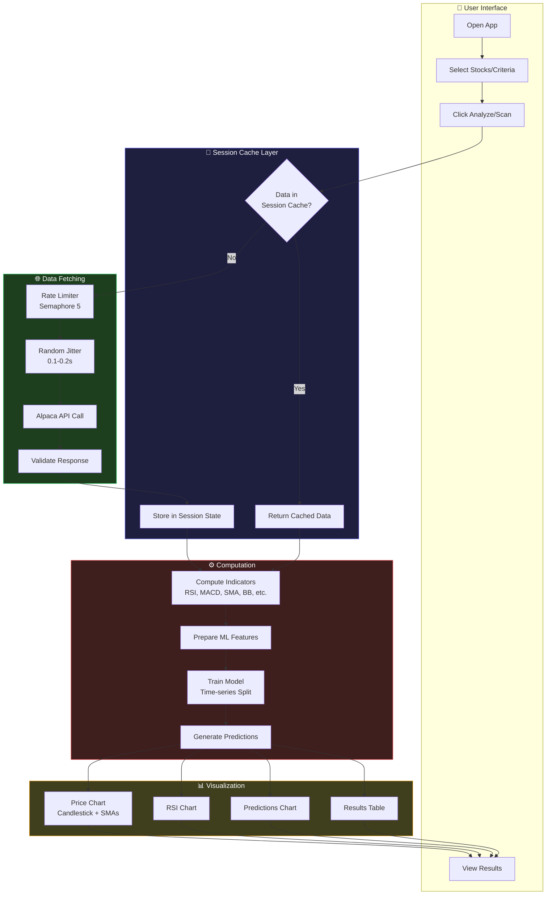
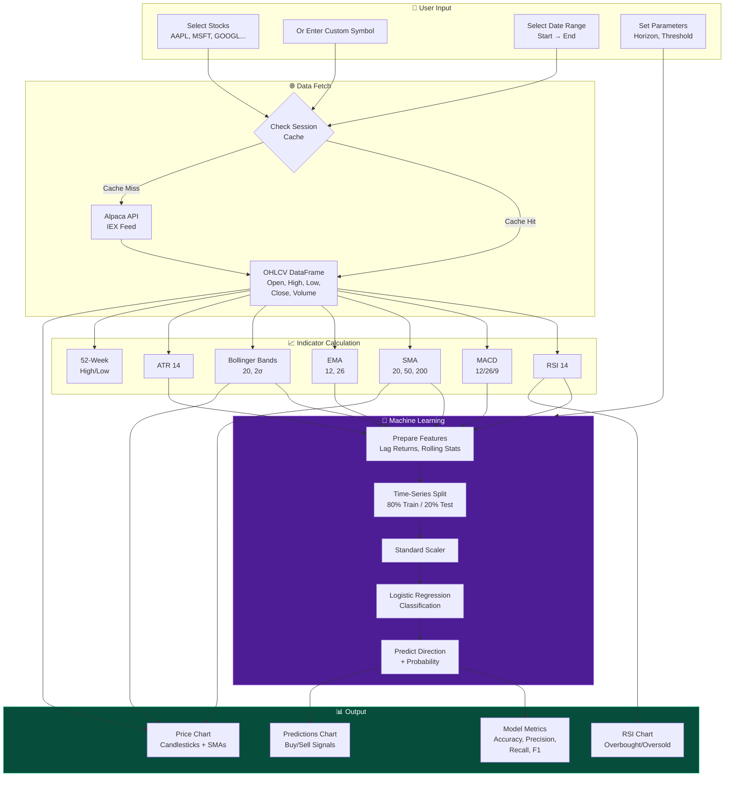
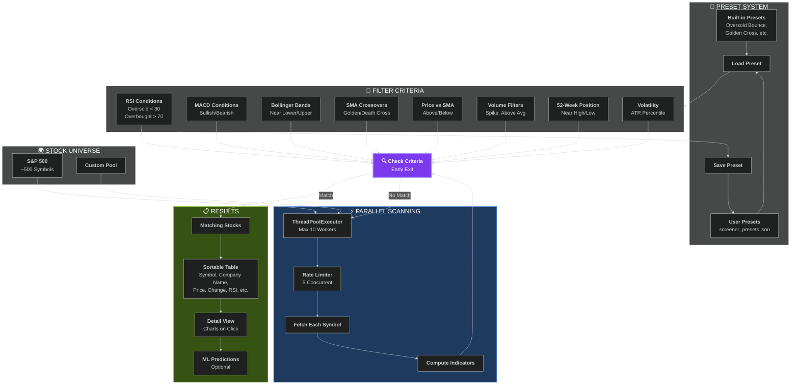
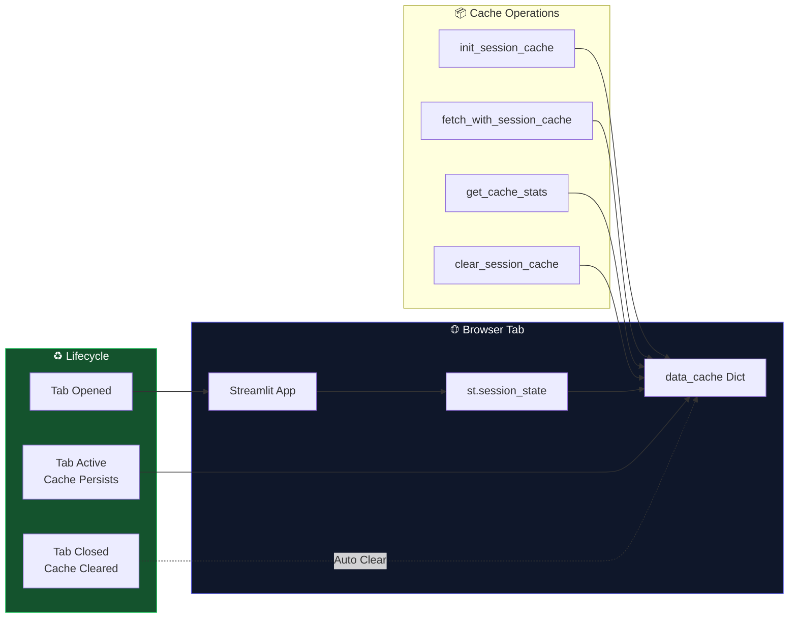
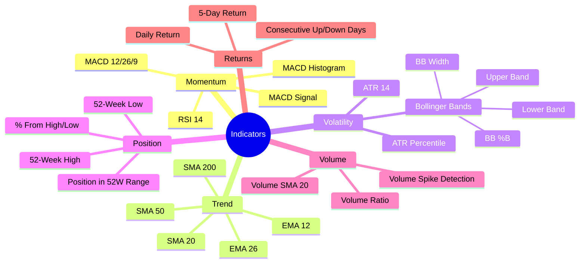
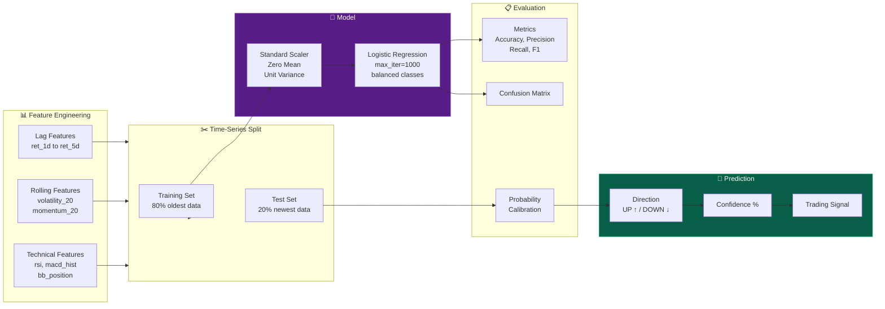
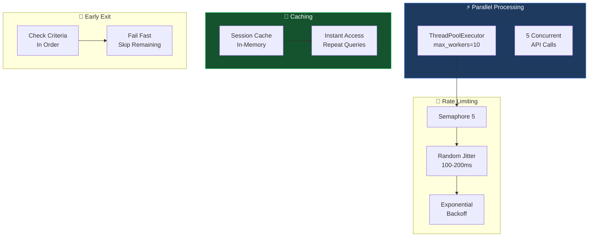
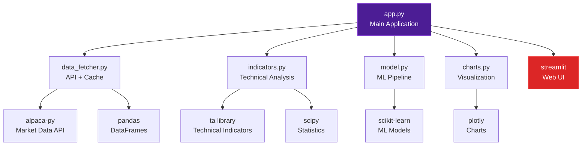

# 📈 Stock Analyzer - System Architecture
  open preview mode using Ctrl + Shift + V
> ML-powered stock analysis with technical indicators and screening capabilities

---

## 🏗️ High-Level Architecture

```
┌─────────────────────────────────────────────────────────────────────────────────┐
│                              STOCK ANALYZER APP                                  │
├─────────────────────────────────────────────────────────────────────────────────┤
│                                                                                  │
│   ┌─────────────────────────────┐      ┌─────────────────────────────┐          │
│   │     📊 Stock Analyzer       │      │     🔎 Stock Screener        │          │
│   │                             │      │                              │          │
│   │  • Single/Multi Stock       │      │  • Batch Market Scanning     │          │
│   │  • Deep Analysis            │      │  • Filter Criteria           │          │
│   │  • ML Predictions           │      │  • Preset Management         │          │
│   │  • Interactive Charts       │      │  • Parallel Processing       │          │
│   └─────────────────────────────┘      └─────────────────────────────┘          │
│                 │                                    │                           │
│                 └──────────────┬─────────────────────┘                           │
│                                │                                                 │
│                                ▼                                                 │
│   ┌─────────────────────────────────────────────────────────────────────────┐   │
│   │                        🧠 SESSION CACHE                                  │   │
│   │                   (Browser Memory - Clears on Tab Close)                 │   │
│   │                                                                          │   │
│   │   st.session_state.data_cache = {                                        │   │
│   │       "AAPL_2022-01-01_2026-01-25": DataFrame(...),                      │   │
│   │       "MSFT_2022-01-01_2026-01-25": DataFrame(...),                      │   │
│   │       ...                                                                │   │
│   │   }                                                                      │   │
│   └─────────────────────────────────────────────────────────────────────────┘   │
│                                │                                                 │
│                                ▼                                                 │
│   ┌─────────────────────────────────────────────────────────────────────────┐   │
│   │                     🌐 DATA FETCHER (Alpaca API)                         │   │
│   │                                                                          │   │
│   │   • Rate-limited (5 concurrent requests)                                 │   │
│   │   • Exponential backoff retry                                            │   │
│   │   • Input validation                                                     │   │
│   └─────────────────────────────────────────────────────────────────────────┘   │
│                                                                                  │
└─────────────────────────────────────────────────────────────────────────────────┘
```

---

## 📁 Project Structure

```
stock-ana/
├── app.py              # Main Streamlit application (UI + Session Cache)
├── data_fetcher.py     # Alpaca API integration + File caching
├── indicators.py       # Technical indicator computations
├── model.py            # ML model training & prediction
├── charts.py           # Plotly chart generation
├── display.py          # Display utilities
├── visualization.py    # Additional visualization helpers
├── main.py             # Flask/CLI alternative entry point
├── requirements.txt    # Python dependencies
├── .env                # API credentials (ALPACA_API_KEY, ALPACA_API_SECRET)
├── screener_presets.json # User-saved screener presets
├── cache/              # Parquet file cache (disabled in session mode)
└── templates/          # HTML templates for Flask
```

---

## 🔄 Complete Data Flow



---

## 📊 Stock Analyzer Tab - Detailed Flow



---

# 🔎 Stock Screener Tab - Detailed Flow



---

## 🧠 Session Caching Architecture



### Cache Key Format
```
{SYMBOL}_{START_DATE}_{END_DATE}

Example: AAPL_2022-01-01_2026-01-25
```

### Cache Benefits
| Feature | Behavior |
|---------|----------|
| **First Fetch** | API call → Store in session_state |
| **Repeat Fetch** | Return from cache (instant) |
| **Tab Reload** | Cache preserved (same session) |
| **Tab Close** | Cache automatically cleared |
| **New Tab** | Fresh session, new cache |

---

## 📈 Technical Indicators Computed



---

## 🤖 ML Pipeline



---

## 🎨 Chart Types

### 1. Price Chart
```
┌────────────────────────────────────────────────────────────┐
│  📈 AAPL Price Chart                                       │
├────────────────────────────────────────────────────────────┤
│                                                            │
│     ████                    ████                           │
│    █    █   ████           █    █          Candlesticks    │
│   █      █ █    █         █      █         (Green=Up)      │
│  █        █      █       █        █        (Red=Down)      │
│ ─────────────────────────────────────────  SMA 20 (Yellow) │
│   ─ ─ ─ ─ ─ ─ ─ ─ ─ ─ ─ ─ ─ ─ ─ ─ ─ ─ ─   SMA 50 (Green)  │
│  ═══════════════════════════════════════   SMA 200 (Purple)│
│  ░░░░░░░░░░░░░░░░░░░░░░░░░░░░░░░░░░░░░░░░  Bollinger Bands │
├────────────────────────────────────────────────────────────┤
│  ▓▓▓  ▓▓▓     ▓▓▓  ▓▓▓     ▓▓▓  ▓▓▓       Volume Bars      │
│  ▓▓▓  ▓▓▓     ▓▓▓  ▓▓▓     ▓▓▓  ▓▓▓       (Green/Red)      │
└────────────────────────────────────────────────────────────┘
```

### 2. RSI Chart
```
┌────────────────────────────────────────────────────────────┐
│  📊 RSI (14)                                               │
├────────────────────────────────────────────────────────────┤
│ 100 ─────────────────────────────────────────────────  ─ ─ │
│  70 ═══════════════════════════════════════════════ OVERBOUGHT
│         ╱╲                     ╱╲                          │
│  50    ╱  ╲       ╱──╲       ╱  ╲           RSI Line       │
│       ╱    ╲     ╱    ╲     ╱    ╲                         │
│  30 ═══════════════════════════════════════════════ OVERSOLD
│   0 ─────────────────────────────────────────────────  ─ ─ │
└────────────────────────────────────────────────────────────┘
```

### 3. Predictions Chart
```
┌────────────────────────────────────────────────────────────┐
│  🔮 ML Predictions                                         │
├────────────────────────────────────────────────────────────┤
│                                                            │
│        ●                    ●          ● = BUY Signal      │
│       ╱ ╲        ●        ╱ ╲                              │
│      ╱   ╲      ╱ ╲      ╱   ╲                             │
│     ╱     ╲    ╱   ╲    ╱     ╲         Price Line         │
│    ╱       ╲  ╱     ╲  ╱       ╲                           │
│             ╲╱       ╲╱         ○        ○ = SELL Signal   │
│              ○                                             │
│                                                            │
│  ░░░░░░░░░░░░░░░░░░░░░░░████████████████  Test Region      │
│                         (Highlighted)                      │
└────────────────────────────────────────────────────────────┘
```

---

## ⚡ Performance Optimizations



---

## 📦 Module Dependencies



---

## 🔐 Environment Configuration

### ⚠️ Required: 2 API Credentials

You need **both** an API Key AND an API Secret from Alpaca:

| Credential | Format | Example |
|------------|--------|---------|
| **API Key** | `PK` + 20 chars | `PKABCD1234EFGH5678XY` |
| **API Secret** | 40 chars | `aBcDeFgHiJkLmNoPqRsTuVwXyZ1234567890abcd` |

### How to Get Your API Keys

1. **Create Account**: Go to [alpaca.markets](https://alpaca.markets) and sign up (free)
2. **Access Dashboard**: Log in to [app.alpaca.markets](https://app.alpaca.markets)
3. **Generate Keys**: Click **"API Keys"** in sidebar → **"Generate New Key"**
4. **Copy Both**: Save both the Key AND Secret (secret is only shown once!)

> 🔒 **Security**: Never share your API secret. If compromised, regenerate immediately.

### .env File Setup

Create a `.env` file in the project root:

```bash
# .env file (DO NOT commit to git!)
ALPACA_API_KEY=your_api_key_here
ALPACA_API_SECRET=your_api_secret_here
```

### API Details
- **Provider**: Alpaca Markets (free tier available)
- **Feed**: IEX (free tier compatible)
- **Rate Limits**: Built-in protection with semaphore + jitter
- **Timeframes**: 1Min, 5Min, 15Min, 30Min, 1Hour, 1Day, 1Week, 1Month
- **Paper Trading**: Use paper account keys for testing (no real money)

---

## 🚀 Quick Start

```bash
# 1. Clone and navigate
cd "stock ana"

# 2. Create virtual environment
python3 -m venv venv
source venv/bin/activate

# 3. Install dependencies
pip install -r requirements.txt

# 4. Set up API credentials
echo "ALPACA_API_KEY=your_key" > .env
echo "ALPACA_API_SECRET=your_secret" >> .env

# 5. Run the app
streamlit run app.py
```

---

## 📝 Key Files Reference

| File | Purpose | Key Functions |
|------|---------|---------------|
| `app.py` | Main UI + Session Cache | `render_analyzer_tab()`, `render_screener_tab()`, `fetch_with_session_cache()` |
| `data_fetcher.py` | Alpaca API Integration | `fetch_stock_data()`, `validate_symbol()` |
| `indicators.py` | Technical Analysis | `compute_all_indicators()`, `get_latest_indicators()` |
| `model.py` | ML Pipeline | `train_and_evaluate()`, `predict_latest()` |
| `charts.py` | Plotly Visualizations | `create_price_chart()`, `create_rsi_chart()` |

---

## ⚠️ Disclaimer

> **Educational purposes only. Not financial advice.**
> 
> This tool is designed for learning about stock analysis and machine learning.
> Past performance does not guarantee future results.
> Always do your own research before making investment decisions.

---

*Generated: January 2026*

